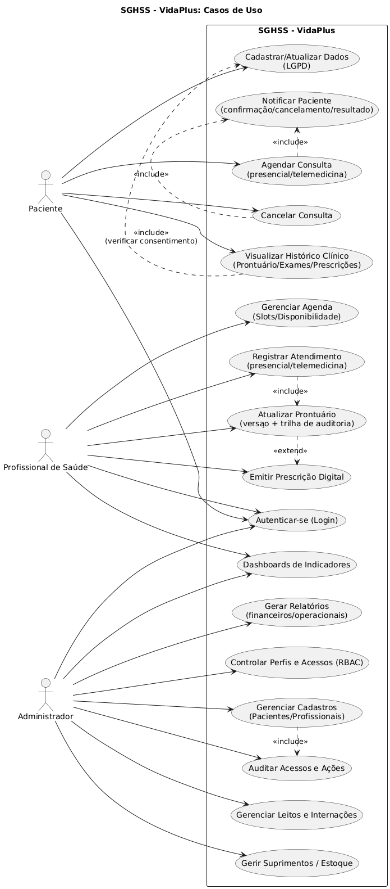
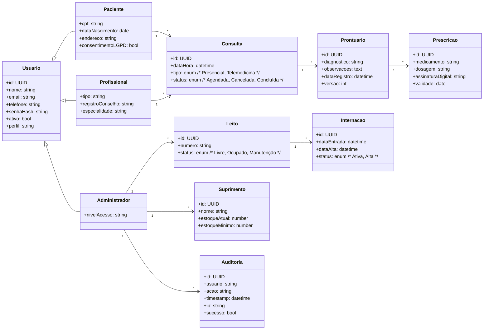
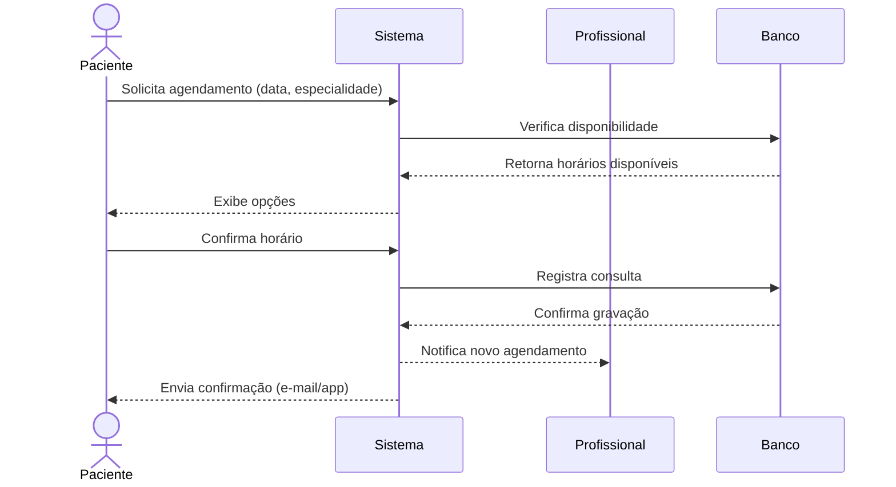
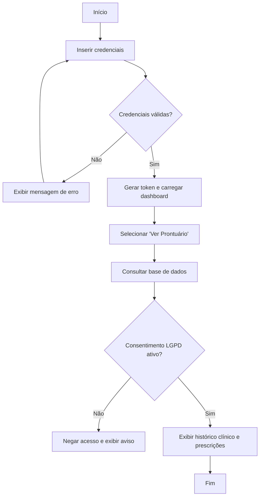

# 03 — Modelagem UML do SGHSS (VidaPlus)

## 1. Diagrama de Casos de Uso
**Descrição:** Representa as principais interações entre os três atores e o sistema **SGHSS – VidaPlus**.

**Atores:**
- **Paciente**
- **Profissional de Saúde** (Médico, Enfermeiro ou Técnico)
- **Administrador**

**Principais Casos de Uso (baseados nos requisitos funcionais):**

|           Ator            |             Caso de Uso               |                                    Descrição                                          |
|---------------------------|---------------------------------------|---------------------------------------------------------------------------------------|
| **Paciente**              | Cadastrar-se / Atualizar dados (LGPD) | Registrar novo paciente e consentimento de uso de dados                               |
| **Paciente**              | Autenticar-se                         | Fazer login com credenciais seguras (token JWT)                                       |
| **Paciente**              | Agendar Consulta                      | Solicitar data e horário com um profissional disponível (presencial ou teleconsulta)  |
| **Paciente**              | Cancelar Consulta                     | Cancelar uma consulta previamente agendada                                            |
| **Paciente**              | Visualizar Histórico Clínico          | Consultar prontuários, exames e prescrições                                           |
| **Profissional de Saúde** | Gerenciar Agenda                      | Criar, editar e excluir horários de atendimento                                       |
| **Profissional de Saúde** | Registrar Atendimento                 | Registrar consulta presencial ou online (telemedicina)                                |
| **Profissional de Saúde** | Atualizar Prontuário                  | Inserir diagnósticos e observações clínicas                                           |
| **Profissional de Saúde** | Emitir Prescrição Digital             | Gerar receita eletrônica assinada digitalmente                                        |
| **Adm**                   | Gerenciar Cadastros                   | Controlar registros de pacientes e profissionais                                      |
| **Adm**                   | Gerenciar Leitos e Internações        | Controlar status de leitos, ocupações e transferências                                |
| **Adm**                   | Gerenciar Suprimentos / Estoque       | Controlar entradas, saídas e níveis mínimos de estoque hospitalar                     |
| **Adm**                   | Gerar Relatórios                      | Criar relatórios financeiros e operacionais por unidade                               |
| **Adm**                   | Controlar Perfis e Acessos (RBAC)     | Definir permissões e papéis de acesso ao sistema                                      |
| **Adm**                   | Auditoria e Logs                      | Monitorar atividades, IPs, horários e resultados de ações                             |
| **Adm / Profissional**    | Dashboard de Indicadores              | Consultar métricas de desempenho, ocupação e atendimentos                             |

**Relações:**
- *Agendar Consulta* «include» *Notificar Paciente*  
- *Cancelar Consulta* «include» *Notificar Paciente*  
- *Registrar Atendimento* «include» *Atualizar Prontuário*  
- *Atualizar Prontuário* «extend» *Emitir Prescrição Digital*  
- *Visualizar Histórico* «include» *Verificar Consentimento LGPD*  
- *Gerenciar Cadastros* «include» *Auditar Ações*  

---

## 2. Diagrama de Classes (Visão Simplificada)
**Descrição:** Representa a estrutura de classes principais do SGHSS e seus relacionamentos.

## 3. Diagrama de Sequência — Fluxo “Agendar Consulta”

## 4. Diagrama de Atividades — Fluxo “Login + Visualizar Prontuário”

## 5. Observações Técnicas

Diagramas desenvolvidos com PlantUML/Mermaid para prototipagem.

Baseados diretamente nos requisitos funcionais RF001–RF019 do documento 02_requisitos.md.

O foco é a rastreabilidade entre os casos de uso e os requisitos (cada RF tem um caso de uso correspondente).

Servem de suporte à fase de testes de qualidade (QA), incluindo automação e rastreio de conformidade LGPD.